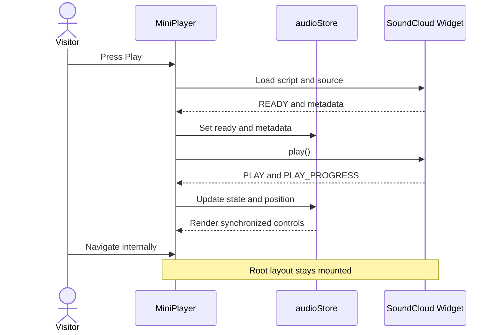

# Design: The Sounds of Take Over

## Technical Approach

The player will be a persistent client-side component mounted in `src/routes/+layout.svelte`. A visually hidden SoundCloud iframe will provide playback while `MiniPlayer.svelte` renders the branded controls.

The SoundCloud Widget API script will load once after the visitor interacts with the player. Widget events will update `audioStore`, keeping the UI synchronized with playback.

## Architecture Decisions

### Decision: SoundCloud for the MVP

- **Choice:** SoundCloud Widget API.
- **Rationale:** Take Over already uses SoundCloud links, public sets can play without site authentication and the widget exposes the events needed by a custom player.
- **Deferred:** Spotify Web Playback SDK because authentication, tokens and Premium requirements expand the scope.

### Decision: Player in the Root Layout

- **Choice:** Mount `MiniPlayer` in `src/routes/+layout.svelte`.
- **Rationale:** The root layout survives client-side route changes, preventing audio restarts.

### Decision: Explicit Playback Only

- **Choice:** Start paused and initialize after Play.
- **Rationale:** Respects browser policies and avoids unexpected audio.

### Decision: Dynamic Supabase Configuration

- **Choice:** Store multiple ordered sources in `tSoundsTakeOver` and manage them from the admin project.
- **Rationale:** The team can publish, reorder, hide and replace sets without redeploying the public website.

## Data Flow



## State Contract

```javascript
{
  status: "idle" | "loading" | "ready" | "error",
  isPlaying: false,
  isExpanded: false,
  isMuted: false,
  volume: 70,
  positionMs: 0,
  durationMs: 0,
  title: "",
  artist: "",
  artworkUrl: "",
  errorMessage: ""
}
```

Widget instances and DOM references MUST remain local to `MiniPlayer.svelte`.

## Component Behavior

### Collapsed

- Artwork or Take Over fallback.
- Truncated title.
- Play/Pause and Expand controls.
- Equalizer animation only during playback.

### Expanded

- Title and creator.
- Seekable progress with elapsed and total time.
- Play/Pause, volume/mute and Collapse controls.
- External SoundCloud source link.

### Error

- Concise unavailable message.
- Retry and Open on SoundCloud actions.
- No modal or blocked page interaction.

## Accessibility

- Icon buttons MUST have accessible labels.
- Controls MUST be keyboard reachable with visible focus.
- Progress and volume MUST expose labels and values.
- Animations MUST respect `prefers-reduced-motion`.
- Status changes SHOULD use a polite live region.

## Responsive Layout

- Desktop: fixed to the lower-right corner.
- Mobile: compact bar above the bottom safe area.
- The z-index MUST remain below blocking overlays and the navigation loader.

## Testing Strategy

### Component Tests

- Store transitions for loading, ready, playing, paused and error.
- Time formatting and progress helpers.
- Controls invoke the widget adapter correctly.

### Manual Verification

- Start audio and navigate through Home, Events, About and Crew.
- Seek, change volume, mute and resume.
- Test compact and expanded states on mobile and desktop.
- Simulate blocked or failed SoundCloud loading.
- Verify keyboard controls, focus and reduced motion.

## Rollout

1. Execute `supabase/tSoundsTakeOver.sql`.
2. Add at least one approved source through the admin screen.
3. Verify locally and in preview.
4. Deploy both projects from their `dev` branches.
